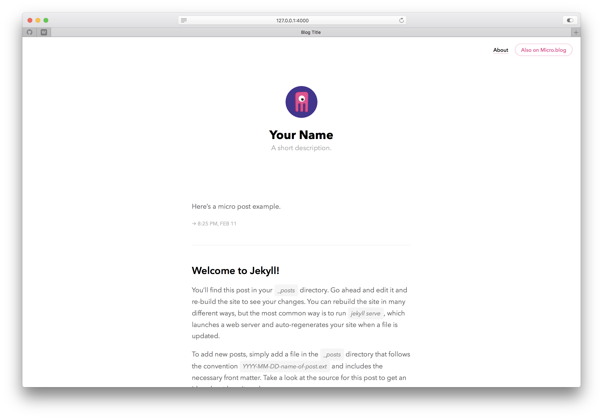

# _Neo Cactus_ for Jekyll

This Jekyll theme started as a port of [Cactus](https://github.com/eudicots/Cactus) to my own needs, but I ended up performing a lot more modifications than expected. Some people reached me out and asked if I could share it, so here we are.

## Usage
To start your project, [fork this respository](https://github.com/mmarfil/neocactus/fork), put in your content, and go!

## Demo
[https://mmarfil.com/](https://mmarfil.com/)
